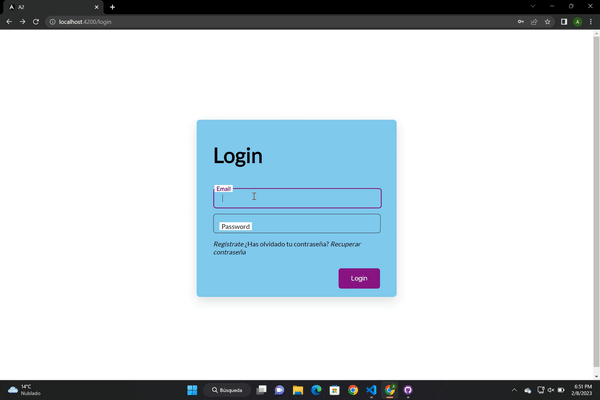

# DWEC
# Analisis  :pencil:

**Primero cree los componentes y luego me puse a trabajar en cada uno de ellos para que quedara lo mejor posible **

*Tu que mirar videos que me explicaran el tema del paht pa que servia y como se insertaba*

# Diseño   :triangular_ruler:

**Respecto a la anterior conseguí que todo me cojiera el estilo.**

# Prueba  :video_camera:

**Aquí podrás ver las validaciones.**

