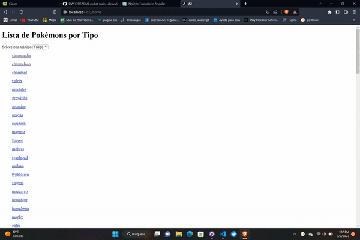

# DWEC
*NgStyle: Nos permite cambiar las propiedades del HTML seleccionado*
# **Ejemplo NgStyle: <h1 [ngStyle]="{'color':'red','background-color':'#ff0','text-align':'center'}">Sitio fuera de servicio</h1>**
*NgClass: Nos permitirán agregar clases dinámicamente sobre el elemento HTML seleccionado.*
# **Ejemplo NgClass: <ul>
  <li *ngFor="let task of tasks" [ngClass]="{ 'completed': task.completed }">{{ task.name }}</li>
</ul>

*NgTemplate: Es un elemento angular utilizado para representar plantillas HTML.*
# **Ejemplo NgTemplate: 
 ng-template works!
<ng-template>Inside ng-template tag</ng-template>**
<<<<<<< HEAD

# DWEC
# Analisis  :pencil:

**Primero miro los videos para poder hacerme una idea de la logica de angular**

*Tuve que mirar bien el video para poder usar el onchange*

# Diseño   :triangular_ruler:

**El diseño es simple pero lo importante creo que es que coja la logica de angular y funcione las peticiones**

# Prueba  :video_camera:

**En este video se verá como funciona los 3 tipos de pokemon**

 

