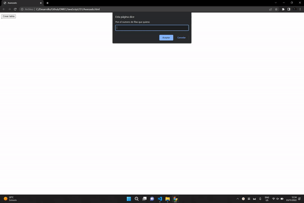

# DWEC
# Analisis 

**He necesitado mirar como se usaba el Math.random porque no me acordaba de la forma de escritura del código**

*Tambien e tenido que mirar el uso de insertRow porque no sabia como se usaba*

# Diseño 

**Lo e ido soluciando con la busqueda de datos por google y intentado a la vez de hacerlo aprender para un próximo proyecto.**

*Tambien e ido viendo videos para tener una explicacion más explicita y poder enterarme mejor del problema que tenia yo a la hora de resolver mi ejercicio*

# Prueba

