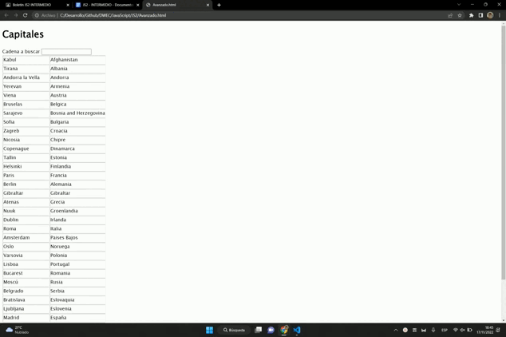

# DWEC
# Analisis  :pencil:

**Primero analizé el problema y vi las diferencias que tenia con el anterior e intenté solucionarlo como el anterior al ver que no podía pues me puse a buscar otra forma para poder realizar el ejercicio**

*He tenido que volver a mirar el insertRow*

# Diseño   :triangular_ruler:

**Me han costado mucho sacar esto no se porque porque era muy parecido al anterior al bloquearme e pedido ayuda a un compañero me ha ayudado el a solucionar algunos errores que me daban.**

*Tambien e ido viendo videos para tener una explicacion más explicita y poder enterarme mejor del problema que tenia yo a la hora de resolver mi ejercicio*

# Prueba  :video_camera:

**En vez de 8 Videos lo e metido todos en uno**

