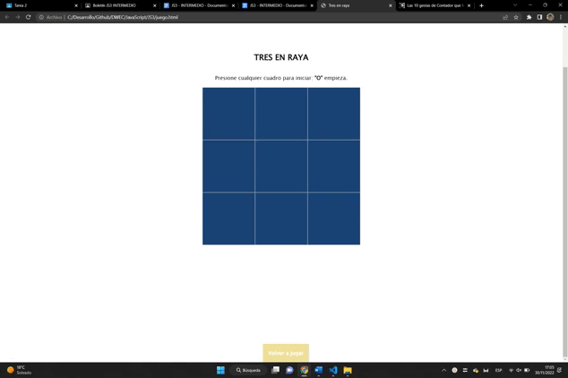

# DWEC
# Analisis  :pencil:

**Este ejercicio lo primero que hice fue analizar las distintas posibilidades de trabajo que había sobre el intenté varias formas pero al final me quedé con la más efectiva**

*He tenido que mirar como se podía insertar una imagen en el js 'src' 'Nombre de la imagen'*

# Diseño   :triangular_ruler:

**No e sido capaz de sacar el contador.**

*He intentado sacarlo solo con ayuda pero no se porqué lo fácil aveces en mi cabeza se hace difícil.*

# Prueba  :video_camera:

**Aquí tienes los distintos casos de prueba Gana rajoy, gana Kiko, y empatan.**

