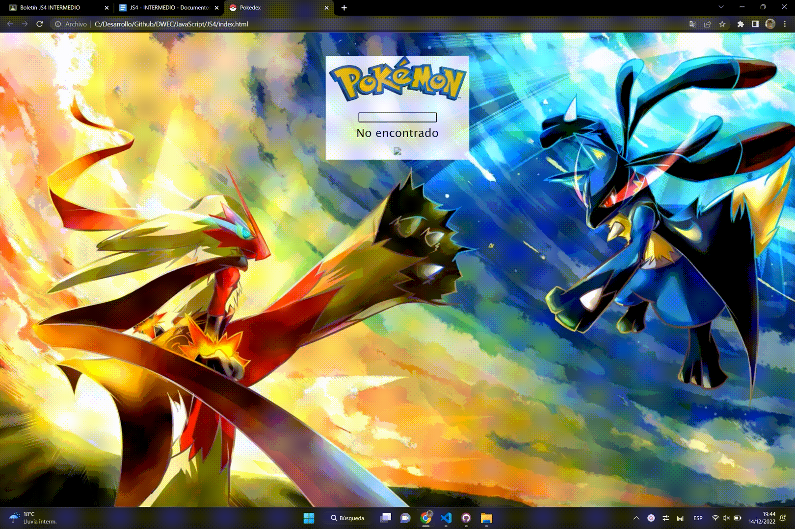

# DWEC
# Analisis  :pencil:

**Lo primero que hize fue ver el video que el profesor subio  para intentar coger el concepto del trabajo a realizar luego analizé los distintos problemas que tenia para resolverlos y despues empezé con los diseños de soluciones**

# Diseño   :triangular_ruler:

*Lo e sacado lo mas propio posible por eso tiene este diseño tan simple.*

# Prueba  :video_camera:

**Aquí tienes los dos casos de pruebas buscar un pokémon existente y otro que no**

